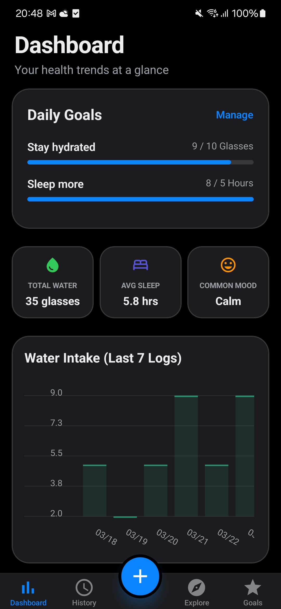
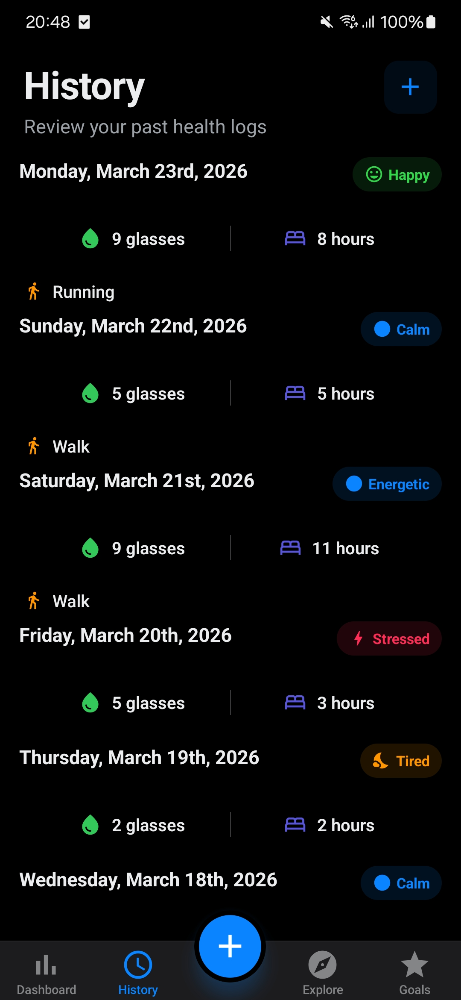
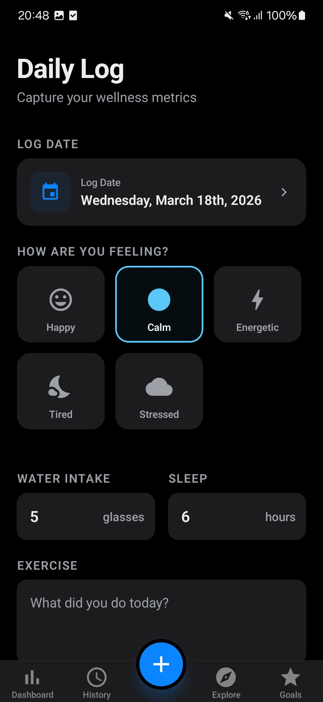
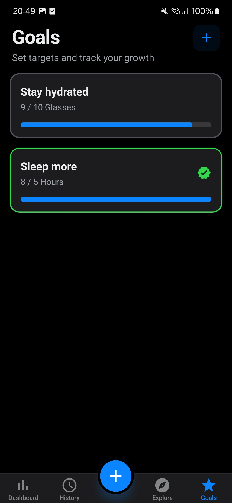

# Health Tracker 📱

A premium Expo-based health and wellness tracking application designed with a "perceived performance" focus. This app allows users to log daily wellness metrics, track goals, and discover curated health articles.

## 🚀 Key Features

- **Daily Logging**: Log mood, water intake, and sleep metrics using an interactive, validated form (Zod + React Hook Form).
- **Dashboard & Analytics**: Visualize health metrics over time with dynamic charts (Mood, Water, Sleep).
- **Infinite Discovery Feed**: Real-time articles from Hashnode's GraphQL API with high-performance cursor-based pagination.
- **Goal Management**: Create and track personalized health goals with real-time visual progress monitoring.
- **Premium UX**: Hardware-accelerated parallax headers, pulsing skeleton loaders, and flicker-free transitions between light/dark modes.
- **Deep Navigation**: Full Stack + Tabs nested navigation architecture with persistent scroll states and "Scroll to Top" shortcuts.

## 📸 App Preview

| Dashboard | History Log | Add Log |
|-----------|-------------|---------|
|  |  |  |

| Explore Feed | Article Detail | Goals |
|--------------|----------------|-------|
|  |  |  |

---

## 🛠 Setup & Run Instructions

Assume a clean environment with Node.js and standard Expo/React Native prerequisites installed.

### 1. Installation

```bash
# Clone the repository
git clone https://github.com/kailik98/health-tracker-expo.git
cd health-tracker

# Install dependencies
npm install
```

### 2. Configure Environment

The app uses a direct connection to the **Hashnode GraphQL API**. No API keys are required for the public discovery feed.

### 3. Running the App

- **iOS (Simulator)**:
  ```bash
  npm run ios
  ```
- **Android (Emulator)**:
  ```bash
  npm run android
  ```
- **Expo Go (Physical Device)**:
  ```bash
  npm run start
  # Then scan the QR code with the Expo Go app.
  ```

---

## 🏗 Architecture Decisions

### 1. State Management (Redux Toolkit + Redux Persist)

We chose **Redux Toolkit** for the global store because it provides a predictable, normalized way to manage complex data like types of health entries and goals. **Redux Persist** (via `AsyncStorage`) was implemented to ensure user data survives app closures and device reboots without needing a remote backend for this phase.

### 2. Navigation (Expo Router)

The app uses **Expo Router** to manage its navigation graph. This file-based system allowed us to implement sophisticated patterns like "Nested Stack Drill-down" (navigating from a Tab into a detailed Article Stack) while maintaining native gesture responses.

### 3. Performance (FlashList + expo-image)

Standard native lists can lag with thousands of entries. We integrated **`@shopify/flash-list`** to maintain 60FPS even in the never-ending Explore tab. We also used **`expo-image`** for state-of-the-art disk/memory caching of article covers.

### 4. Data Layer (Apollo GraphQL)

Instead of manual `fetch` calls, we used **Apollo Client** for the external discovery engine. This allowed for seamless **Infinite Scrolling** using cursor-based pagination and automated cache merging via custom `InMemoryCache` type policies.

### 5. High-Fidelity UX (Skeletons & Reanimated)

We prioritized "perceived performance." Pulsing **Skeleton Loaders** were custom-built to match the final layout exactly, preventing layout shifts and making the app feel incredibly fast. **React Native Reanimated** handles all complex interactions (Header scaling, FAB visibility) on the native thread.

---

## ⚖️ Trade-offs & Known Limitations

While the current MVP focuses on local performance and core UX, given more time, I would prioritize the following architectural and product enhancements:

- **Cloud Synchronization & Authentication**: Transition from local-first storage (`AsyncStorage`) to a remote database backend (e.g., Supabase or Firebase) with secure user authentication. This would allow users to log in and seamlessly sync their health data across multiple devices.
- **Advanced Calendar Visualization**: Upgrade the History tab with a visual calendar component (like a heatmap or dotted indicators). This would give users an immediate, high-level view of which specific dates contain logged entries without needing to scroll through a list.
- **Expanded Goal Management**: Enhance the goal engine to support more complex data aggregations (e.g., weekly or monthly targets instead of just daily), custom user-defined metrics, and automated milestone notifications to improve user retention.

---

## 💡 Assumptions Made

1. **Active Connection**: The `Explore` tab assumes an active internet connection to reach the public Hashnode servers.
2. **Environment**: Assumed the reviewer is using a modern development environment (macOS for iOS testing) and has the standard Expo developer tools installed.
3. **Data Shape**: Assumed the Hashnode public API schema remains stable for unauthenticated queries to the `#health` tag.
